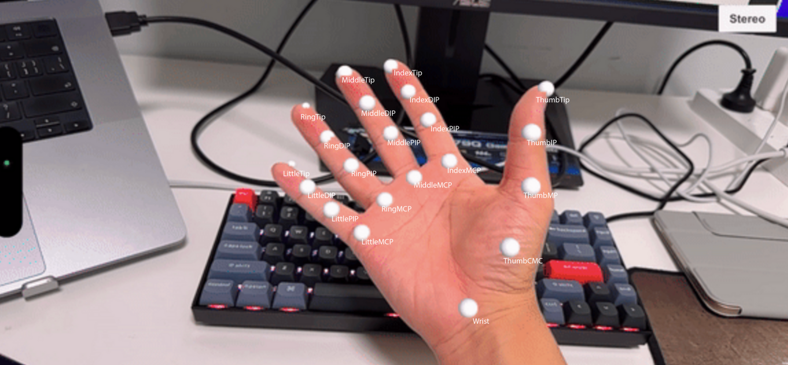

# finger-saber
In this project, I create a demo scene to demonstrate the capabilities of Hand-Tracking feature in HoloKit SDK.

# What is finger-saber

fingers-saber, as the name suggests, involves shooting light sabers from the fingertips. I utilized the Hand Tracking feature in the HoloKit SDK to obtain the position and orientation of the finger nodes.

It provides 21 joints of each hand:

In this scene, it takes positions of TIP and IP to calculate approximately directions of each finger. Then, add saber visual effect along the direction:

# System requirements

1. Unity 2022.3.12f1
2. Xcode 14.2
3. iPhone with Lidar capability

# How to try it

1. Clone the project.
2. Open with Unity.
3. Go to: Scenes → FingerSaber → FingerSaber New
4. Open the scene, build into an Xcode project.
5. Open with Xcode and build to you mobile device.
